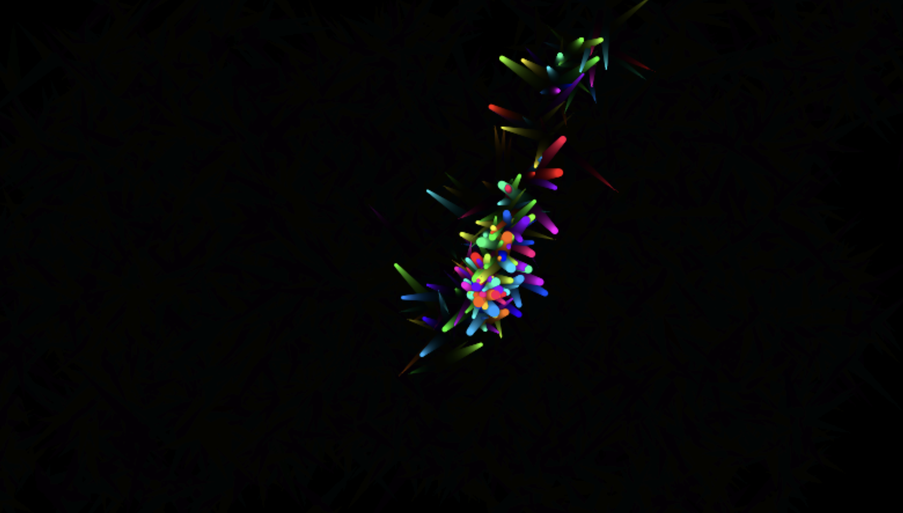

# Colorful Cursor Trail

A simple visual app that creates a colorful trail following your cursor using HTML5 Canvas and JavaScript.

## How to use
Open `2.html` in your browser and move your mouse to see the effect.

## Files
- `2.html`: Main HTML file
- `1.css`: Styles for the app
- `3.js`: JavaScript for the cursor trail effect

### New feature
- Jellyfish swim across the screen as a background visual element. They are drawn procedurally on the canvas and move with a gentle sailing/bobbing motion. You can control the background 8-bit music using the on-screen controls.

## Demo

---
Inspired by Codepen.io visual effects.